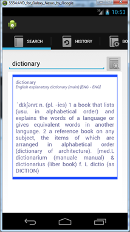

This is a XDXF based Dictionary for Android platform. XDXF (XML Dictionary eXchange Format) is a project to unite all existing open dictionaries and provide both users and developers with universal XML-based format.(Wikipedia) .XDXF Dictionaries/Translations can be downloaded from [Sourceforge](http://sourceforge.net/projects/xdxf/files/dicts-XDXF/)

I **dont** own an Android phone, and i developed this using the simulator and have never tested this on a real phone!

**Features:**
  1. Simple UI
  1. AutoComplete
  1. History
  1. Favorite Word
  1. Add/Remove dictionaries
  1. Export/Import database

**Screenshots**
<table>
<tr>
<td></td>
<td></td>
<td></td>
</tr>
<tr>
<td></td>
<td></td>
<td></td>
</tr>
</table>

